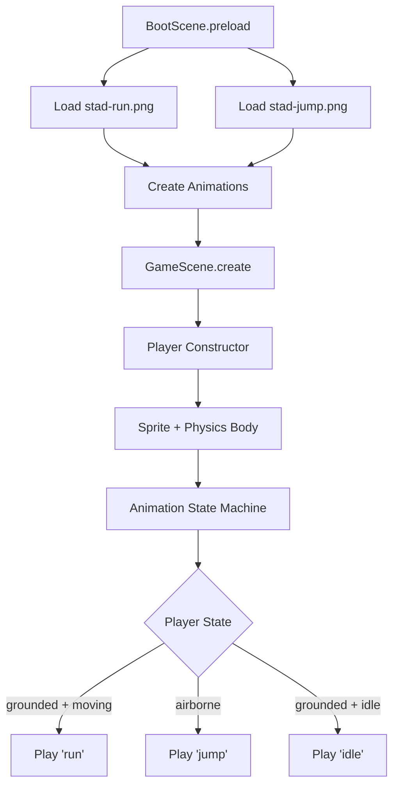

# feat: Integrate Super Stad Character Sprite Sheets

## Overview

Replace the procedurally-generated Super Stad character graphics with high-quality sprite sheet animations. This includes:
- **Running animation**: 36 frames at 256x256 pixels
- **Jump animation**: Separate sprite sheet (running-to-jump transition)

The current game uses Phaser's Graphics API to generate all character sprites at runtime. This feature introduces the game's first external sprite assets, enabling richer character animations.

## Problem Statement / Motivation

**Why this matters:**
- Current procedural graphics are functional placeholders but lack visual polish
- Hand-drawn sprite sheets provide better character personality and animation fluidity
- 36-frame running cycle enables smooth, professional-quality animation
- Separate jump animation adds visual feedback for player actions

**Current state:**
- All sprites generated in `src/utils/CharacterSprites.js`
- Player uses 64x80 pixel procedural graphics scaled to 0.8 (51x64 display)
- No external image files in `assets/sprites/` directory

## Proposed Solution

Implement Phaser 3 sprite sheet loading with proper scaling and animation definitions:

1. Load 256x256 sprite sheets in BootScene
2. Create animation definitions (run, jump, idle)
3. Update Player.js to use sprites instead of graphics
4. Configure physics body to match character hitbox
5. Maintain fallback to procedural graphics if sprites fail to load

## Technical Approach

### Architecture



### File Structure

```
assets/
├── sprites/
│   ├── super-stad-run.png      # 36 frames @ 256x256 (6x6 grid: 1536x1536)
│   └── super-stad-jump.png     # TBD frames @ 256x256
```

### Implementation Phases

#### Phase 1: Asset Preparation & Configuration

**Tasks:**
- [ ] Add sprite sheet files to `assets/sprites/`
- [ ] Create sprite configuration in `src/config/sprites.js`
- [ ] Validate sprite sheet dimensions and transparency

**New file: `src/config/sprites.js`**
```javascript
export const SPRITE_CONFIG = {
  player: {
    run: {
      key: 'stad-run',
      path: 'assets/sprites/super-stad-run.png',
      frameWidth: 256,
      frameHeight: 256,
      // Assumes 6x6 grid layout
    },
    jump: {
      key: 'stad-jump',
      path: 'assets/sprites/super-stad-jump.png',
      frameWidth: 256,
      frameHeight: 256,
    }
  },
  animations: {
    'stad-idle': { frames: [0, 5], fps: 8, repeat: -1 },
    'stad-run': { frames: [0, 35], fps: 12, repeat: -1 },
    'stad-jump': { frames: [0, 9], fps: 10, repeat: 0 }
  },
  physics: {
    scale: 0.25,           // 256x256 -> 64x64 display
    bodyWidth: 160,        // In original 256px frame coords
    bodyHeight: 200,
    bodyOffsetX: 48,       // (256 - 160) / 2
    bodyOffsetY: 40
  }
};
```

#### Phase 2: Sprite Loading

**Modify: `src/scenes/BootScene.js`**
```javascript
// In preload()
import { SPRITE_CONFIG } from '../config/sprites.js';

preload() {
  // Load running sprite sheet
  this.load.spritesheet(
    SPRITE_CONFIG.player.run.key,
    SPRITE_CONFIG.player.run.path,
    {
      frameWidth: SPRITE_CONFIG.player.run.frameWidth,
      frameHeight: SPRITE_CONFIG.player.run.frameHeight
    }
  );

  // Load jump sprite sheet
  this.load.spritesheet(
    SPRITE_CONFIG.player.jump.key,
    SPRITE_CONFIG.player.jump.path,
    {
      frameWidth: SPRITE_CONFIG.player.jump.frameWidth,
      frameHeight: SPRITE_CONFIG.player.jump.frameHeight
    }
  );

  // Error handling
  this.load.on('loaderror', (file) => {
    console.warn('Failed to load sprite:', file.key);
    this.useFallbackGraphics = true;
  });
}
```

#### Phase 3: Animation Definitions

**Add to: `src/scenes/BootScene.js` or `GameScene.js`**
```javascript
createPlayerAnimations() {
  // Idle animation (subset of run frames)
  this.anims.create({
    key: 'stad-idle',
    frames: this.anims.generateFrameNumbers('stad-run', { start: 0, end: 5 }),
    frameRate: 8,
    repeat: -1
  });

  // Run animation (full 36-frame cycle)
  this.anims.create({
    key: 'stad-run',
    frames: this.anims.generateFrameNumbers('stad-run', { start: 0, end: 35 }),
    frameRate: 12,
    repeat: -1
  });

  // Jump animation
  this.anims.create({
    key: 'stad-jump',
    frames: this.anims.generateFrameNumbers('stad-jump', { start: 0, end: 9 }),
    frameRate: 10,
    repeat: 0  // Play once
  });
}
```

#### Phase 4: Player.js Refactor

**Modify: `src/objects/Player.js`**

```javascript
import { SPRITE_CONFIG } from '../config/sprites.js';

constructor(scene, x, y, runSpeed = 200) {
  this.scene = scene;

  // Stats (unchanged)
  this.maxHearts = 3;
  this.hearts = 3;
  this.runSpeed = runSpeed;
  this.jumpForce = -420;

  // Create sprite from sheet instead of procedural graphics
  if (scene.textures.exists('stad-run')) {
    this.sprite = scene.physics.add.sprite(x, y, 'stad-run');
    this.sprite.setScale(SPRITE_CONFIG.physics.scale);  // 0.25

    // Configure physics body (values in original 256px frame coords)
    this.sprite.body.setSize(
      SPRITE_CONFIG.physics.bodyWidth,   // 160
      SPRITE_CONFIG.physics.bodyHeight   // 200
    );
    this.sprite.body.setOffset(
      SPRITE_CONFIG.physics.bodyOffsetX, // 48
      SPRITE_CONFIG.physics.bodyOffsetY  // 40
    );

    // Start idle animation
    this.sprite.play('stad-idle');
  } else {
    // Fallback to procedural graphics
    this.createFallbackGraphics(scene, x, y);
  }

  // Physics settings (unchanged)
  this.sprite.setCollideWorldBounds(false);
  this.sprite.setBounce(0);
}

updateAnimation(isRunning) {
  const currentAnim = this.sprite.anims?.currentAnim?.key;

  if (!this.canJump) {
    // In the air
    if (currentAnim !== 'stad-jump') {
      this.sprite.play('stad-jump');
    }
  } else if (isRunning) {
    // Running on ground
    if (currentAnim !== 'stad-run') {
      this.sprite.play('stad-run');
    }
  } else {
    // Idle
    if (currentAnim !== 'stad-idle') {
      this.sprite.play('stad-idle');
    }
  }
}

createFallbackGraphics(scene, x, y) {
  // Keep existing procedural graphics as fallback
  // This preserves backward compatibility
}
```

#### Phase 5: Testing & Validation

**Visual debug enabled in `src/main.js`:**
```javascript
physics: {
  default: 'arcade',
  arcade: {
    gravity: { y: 800 },
    debug: true  // Shows collision boxes
  }
}
```

## Acceptance Criteria

### Functional Requirements

- [ ] Running sprite sheet loads without errors
- [ ] Jump sprite sheet loads without errors
- [ ] Run animation plays at 12fps with smooth looping
- [ ] Jump animation plays once when player leaves ground
- [ ] Animation transitions correctly: idle ↔ run ↔ jump
- [ ] Sprite scales from 256x256 to ~64x64 display size
- [ ] Physics body matches character hitbox (not full frame)
- [ ] Player stands correctly on ground at Y=340
- [ ] Fallback to procedural graphics if sprites fail to load

### Non-Functional Requirements

- [ ] No visible background around character (transparency works)
- [ ] Frame rate remains 60fps on desktop
- [ ] No console errors or warnings
- [ ] Sprite sheet file size under 500KB each (optimized PNGs)

### Quality Gates

- [ ] Keyboard controls work (arrow keys)
- [ ] Touch controls work (swipe up/down)
- [ ] Collisions detect properly with obstacles
- [ ] No visual clipping through ground or obstacles
- [ ] Responsive at different window sizes

## Success Metrics

- Character visually matches intended design
- Animation transitions feel responsive (< 100ms)
- No player complaints about collision fairness
- Sprite sheets load in < 500ms on 3G connection

## Dependencies & Prerequisites

### Required Before Implementation

1. **Sprite sheet files** must be provided:
   - `super-stad-run.png` - 36 frames at 256x256
   - `super-stad-jump.png` - Frame count TBD

2. **Clarification questions answered** (see below)

### System Dependencies

- Phaser 3 (already installed)
- PNG file format with alpha channel

## Risk Analysis & Mitigation

| Risk | Likelihood | Impact | Mitigation |
|------|------------|--------|------------|
| Sprite sheet too large for mobile GPU | Medium | High | Use 6x6 grid (1536x1536), optimize PNG |
| Collision feels unfair after change | Medium | Medium | Enable debug mode, tune hitbox empirically |
| Load failure crashes game | Low | High | Implement fallback to procedural graphics |
| Animation timing mismatch with physics | Medium | Low | Adjust frame rates to match jump duration |

## Questions Requiring Clarification

### Critical (Blocks Implementation)

1. **What is the frame layout of the running sprite sheet?**
   - 6x6 grid (1536x1536 total)?
   - Horizontal strip (9216x256)?
   - Other arrangement?

2. **How many frames are in the jump sprite sheet?**
   - What is its layout?

3. **Do sprite sheets have transparent backgrounds?**
   - PNG with alpha channel?

4. **Where is the character positioned within the 256x256 frame?**
   - Centered?
   - Bottom-aligned (feet at y=256)?

5. **What are the actual character bounding box dimensions within each frame?**
   - How much whitespace surrounds the character?

6. **Which frames correspond to which animation states?**
   - All 36 frames = run cycle?
   - Or split between idle (0-7) and run (8-35)?

### Important (Affects Quality)

7. **What frame rate should each animation play at?**
   - Running: 12fps?
   - Jump: 10fps?
   - Idle: 8fps?

8. **Does the game need a slide animation?**
   - Which frames/sheet should be used?

9. **Are damage/death animations included?**
   - Or use tint flash + stop animation?

10. **What file paths should be used?**
    - `assets/sprites/super-stad-run.png`?
    - Different naming convention?

## MVP Implementation

### `src/config/sprites.js`

```javascript
// New file - sprite sheet configuration
export const SPRITE_CONFIG = {
  player: {
    run: {
      key: 'stad-run',
      path: 'assets/sprites/super-stad-run.png',
      frameWidth: 256,
      frameHeight: 256,
    },
    jump: {
      key: 'stad-jump',
      path: 'assets/sprites/super-stad-jump.png',
      frameWidth: 256,
      frameHeight: 256,
    }
  },
  physics: {
    scale: 0.25,
    bodyWidth: 160,
    bodyHeight: 200,
    bodyOffsetX: 48,
    bodyOffsetY: 40
  }
};
```

### Key Changes to `src/scenes/BootScene.js`

```javascript
// Add in preload() after existing code
this.load.spritesheet('stad-run', 'assets/sprites/super-stad-run.png', {
  frameWidth: 256,
  frameHeight: 256
});

this.load.spritesheet('stad-jump', 'assets/sprites/super-stad-jump.png', {
  frameWidth: 256,
  frameHeight: 256
});

// Add in create() or separate method
this.anims.create({
  key: 'stad-run',
  frames: this.anims.generateFrameNumbers('stad-run', { start: 0, end: 35 }),
  frameRate: 12,
  repeat: -1
});
```

### Key Changes to `src/objects/Player.js`

```javascript
// Replace procedural sprite creation with:
this.sprite = scene.physics.add.sprite(x, y, 'stad-run');
this.sprite.setScale(0.25);  // 256 -> 64 pixels
this.sprite.body.setSize(160, 200);  // Hitbox in original coords
this.sprite.body.setOffset(48, 40);  // Center on character
this.sprite.play('stad-run');
```

## Testing Checklist

Based on CLAUDE.md requirements:

- [ ] Works with keyboard controls (arrow keys)
- [ ] Works with touch controls (swipe up/down)
- [ ] Collisions detect properly
- [ ] No console errors
- [ ] Responsive at different window sizes
- [ ] Sprite transparency renders correctly
- [ ] Ground alignment is correct (no floating/sinking)
- [ ] Animation transitions are smooth

## References

### Internal References
- `src/objects/Player.js:20-35` - Current sprite creation and physics body setup
- `src/utils/CharacterSprites.js:8-23` - Procedural sprite generation (fallback reference)
- `src/scenes/BootScene.js:38-42` - Comment about future sprite support
- `CLAUDE.md:47-54` - Asset structure documentation

### External References
- [Phaser 3 Sprite Sheet Loading](https://docs.phaser.io/phaser/concepts/loader)
- [Phaser 3 Animation System](https://docs.phaser.io/phaser/concepts/animations)
- [Phaser 3 Arcade Physics Body](https://docs.phaser.io/phaser/concepts/physics/arcade)
- [Phaser Making Your First Game - Animations](https://phaser.io/tutorials/making-your-first-phaser-3-game/part5)

### Related Work
- Known issue in CLAUDE.md: "Using Phaser graphics (rectangles/shapes) until real sprites are added"
